# ?? Diagrama de Classes UML - MeloQuiz

**Projeto:** MeloQuiz - Jogo de Treinamento de Ouvido Musical  
**Autor:** Igor Pessoa  
**Data:** Outubro 2025

---

## ?? Visão Geral da Arquitetura

```
???????????????????????????????????????????????????????????????????????
?                         PADRÃO MVC                                   ?
???????????????????????????????????????????????????????????????????????
?  MODEL                 CONTROLLER              VIEW                 ?
?  ?? GameEngine         ?? MainComponent        ?? MidiKeyboard      ?
?  ?? Challenge          ?? ...                  ?   Component         ?
?  ?? MelodyChallenge                            ?? VirtualKeyboard   ?
?  ?? Note                                           Component         ?
?  ?? NoteSequence                                                     ?
???????????????????????????????????????????????????????????????????????
```

---

## ?? Diagrama UML Completo

```plantuml
@startuml MeloQuiz Class Diagram

' ============================================================================
' CLASSES DO MODELO (MODEL)
' ============================================================================

package "Model" {
    
    ' Classe Note
    class Note {
        - midiNoteNumber : int
        - velocity : int
        --
        + Note(midiNote: int, noteVelocity: int)
        + getMidiNoteNumber() : int
        + getVelocity() : int
        + operator==(other: Note) : bool
    }
    
    ' Classe NoteSequence
    class NoteSequence {
        - notes : vector<Note>
        --
        + NoteSequence()
        + addNote(note: Note) : void
        + clear() : void
        + size() : size_t
        + getNotes() : vector<Note>&
    }
    
    ' Classe Challenge (Abstrata)
    abstract class Challenge {
        # targetSequence : NoteSequence
        --
        + ~Challenge() {virtual}
        + {abstract} generateSequence(difficulty: int) : void
        + {abstract} isCorrect(userSequence: NoteSequence) : bool
        + getTargetSequence() : NoteSequence&
    }
    
    ' Classe MelodyChallenge
    class MelodyChallenge {
        --
        + generateSequence(difficulty: int) : void {override}
        + isCorrect(userSequence: NoteSequence) : bool {override}
    }
    
    ' Classe GameEngine
    class GameEngine {
        - currentChallenge : unique_ptr<Challenge>
        - userInputSequence : NoteSequence
        - score : int
        - current_challenge_size : int
        --
        + GameEngine()
        + startNewGame(notes_quantity: int) : void
        + nextLevel() : void
        + processUserInput(note: Note) : void
        + checkUserSequence() : bool
        + getUserInputSequence() : NoteSequence&
        + clearUserInput() : void
        + getScore() : int
        + getCurrentTargetSequence() : NoteSequence&
    }
    
    ' Relações do Modelo
    NoteSequence "1" *-- "0..*" Note : contém
    Challenge "1" *-- "1" NoteSequence : possui targetSequence
    MelodyChallenge --|> Challenge : herda
    GameEngine "1" *-- "1" NoteSequence : possui userInputSequence
    GameEngine "1" o-- "0..1" Challenge : possui (unique_ptr)
}

' ============================================================================
' CLASSES DE ÁUDIO
' ============================================================================

package "Audio" {
    
    ' Classe SimpleSineSound
    class SimpleSineSound {
        --
        + SimpleSineSound()
        + appliesToNote(noteNumber: int) : bool {override}
        + appliesToChannel(midiChannel: int) : bool {override}
    }
    
    ' Classe SimpleSineVoice
    class SimpleSineVoice {
        - currentAngle : double
        - angleDelta : double
        - level : double
        - tailOff : double
        - currentNoteNumber : int
        - adsr : ADSR
        --
        + SimpleSineVoice()
        + canPlaySound(sound: SynthesiserSound*) : bool {override}
        + startNote(midiNoteNumber: int, velocity: float, ...) : void {override}
        + stopNote(velocity: float, allowTailOff: bool) : void {override}
        + pitchWheelMoved(newPitchWheelValue: int) : void {override}
        + controllerMoved(controllerNumber: int, newValue: int) : void {override}
        + renderNextBlock(outputBuffer: AudioBuffer<float>&, ...) : void {override}
    }
    
    ' Relações de herança JUCE
    SimpleSineSound --|> "juce::SynthesiserSound" : herda
    SimpleSineVoice --|> "juce::SynthesiserVoice" : herda
}

' ============================================================================
' CLASSES DE INTERFACE/CONTROLLER
' ============================================================================

package "View/Controller" {
    
    ' Classe VirtualKeyboardComponent
    class VirtualKeyboardComponent {
        - keyStates : vector<bool>
        --
        + VirtualKeyboardComponent()
        + ~VirtualKeyboardComponent() {override}
        + paint(g: Graphics&) : void {override}
        + resized() : void {override}
        + setKeyPressed(midiNote: int, isDown: bool) : void
    }
    
    ' Classe MainComponent (Controller Principal)
    class MainComponent {
        - gameEngine : GameEngine
        - keyboardState : MidiKeyboardState
        - keyboardComponent : MidiKeyboardComponent
        - midiInput : unique_ptr<MidiInput>
        - startButton : TextButton
        - replayButton : TextButton
        - numNotesSlider : Slider
        - numNotesLabel : Label
        - flashColour : Colour
        - flashOpacity : float
        - audioDeviceManager : AudioDeviceManager
        - synth : Synthesiser
        - midiCollector : MidiMessageCollector
        - audioSourcePlayer : AudioSourcePlayer
        - sequenceBuffer : MidiBuffer
        - sequencePosition : int
        - isPlayingSequence : bool
        - sampleRate : double
        --
        + MainComponent()
        + ~MainComponent() {override}
        + handleIncomingMidiMessage(source: MidiInput*, message: MidiMessage&) : void {override}
        + paint(g: Graphics&) : void {override}
        + resized() : void {override}
        + prepareToPlay(samplesPerBlockExpected: int, sampleRate: double) : void {override}
        + getNextAudioBlock(bufferToFill: AudioSourceChannelInfo&) : void {override}
        + releaseResources() : void {override}
        - timerCallback() : void {override}
        - playSequence() : void
    }
    
    ' Relações de herança JUCE
    VirtualKeyboardComponent --|> "juce::Component" : herda
    MainComponent --|> "juce::Component" : herda
    MainComponent ..|> "juce::MidiInputCallback" : implementa
    MainComponent ..|> "juce::Timer" : implementa
    MainComponent ..|> "juce::AudioSource" : implementa
    
    ' Relações de composição
    MainComponent "1" *-- "1" GameEngine : possui
    MainComponent "1" *-- "1" "juce::MidiKeyboardComponent" : possui
    MainComponent "1" o-- "0..1" VirtualKeyboardComponent : pode usar
    MainComponent "1" *-- "1" "juce::Synthesiser" : possui
}

' ============================================================================
' RELAÇÕES ENTRE PACOTES
' ============================================================================

MainComponent ..> Note : usa
MainComponent ..> NoteSequence : usa
MainComponent ..> SimpleSineVoice : cria
MainComponent ..> SimpleSineSound : cria
"juce::Synthesiser" ..> SimpleSineVoice : gerencia

' ============================================================================
' NOTAS E LEGENDAS
' ============================================================================

note right of Challenge
  **Padrão Strategy**
  Classe abstrata que define
  interface para diferentes
  tipos de desafios
end note

note right of GameEngine
  **Motor do Jogo**
  Gerencia estado do jogo,
  pontuação e desafios
  usando Smart Pointers
end note

note right of MainComponent
  **Controller MVC**
  Coordena Model e View
  Implementa múltiplas
  interfaces JUCE
end note

note right of SimpleSineVoice
  **Sintetizador de Piano**
  Gera som usando 7 harmônicos
  com envelope ADSR dinâmico
end note

@enduml
```



---

## ?? Legenda de Notações UML

### Tipos de Relações

| Símbolo | Significado | Exemplo no Projeto |
|---------|-------------|-------------------|
| `??>` | **Associação** | MainComponent usa Note |
| `*??` | **Composição** (forte) | NoteSequence contém Notes |
| `o??` | **Agregação** (fraca) | GameEngine possui Challenge via unique_ptr |
| `???` | **Herança/Generalização** | MelodyChallenge herda de Challenge |
| `..?` | **Implementação de Interface** | MainComponent implementa MidiInputCallback |
| `..>` | **Dependência** | MainComponent depende de SimpleSineVoice |

### Modificadores de Visibilidade

| Símbolo | Significado |
|---------|-------------|
| `+` | **public** |
| `-` | **private** |
| `#` | **protected** |

### Tipos de Métodos

| Notação | Significado |
|---------|-------------|
| `{abstract}` | Método virtual puro |
| `{override}` | Sobrescreve método da classe base |
| `{virtual}` | Método virtual |

---

## ?? Diagrama de Composição Simplificado

```
MainComponent
    ??? possui (composição)
    ?   ??? GameEngine
    ?   ?   ??? possui (composição)
    ?   ?   ?   ??? NoteSequence (userInputSequence)
    ?   ?   ?       ??? contém múltiplos Note
    ?   ?   ??? possui (agregação via unique_ptr)
    ?   ?       ??? Challenge (pode ser MelodyChallenge)
    ?   ?           ??? possui (composição)
    ?   ?               ??? NoteSequence (targetSequence)
    ?   ?                   ??? contém múltiplos Note
    ?   ?
    ?   ??? MidiKeyboardComponent (JUCE)
    ?   ??? MidiKeyboardState (JUCE)
    ?   ??? Synthesiser (JUCE)
    ?   ?   ??? contém múltiplas SimpleSineVoice
    ?   ?   ??? contém SimpleSineSound
    ?   ??? AudioDeviceManager (JUCE)
    ?   ??? AudioSourcePlayer (JUCE)
    ?   ??? MidiMessageCollector (JUCE)
    ?   ?
    ?   ??? TextButton (startButton)
    ?   ??? TextButton (replayButton)
    ?   ??? Slider (numNotesSlider)
    ?   ??? Label (numNotesLabel)
    ?
    ??? herda de
        ??? juce::Component
        ??? implementa interfaces
            ??? juce::MidiInputCallback
            ??? juce::Timer
            ??? juce::AudioSource
```

---

## ?? Padrões de Design Identificados

### 1. **Strategy Pattern** ?
```
Challenge (interface abstrata)
    ??? MelodyChallenge (implementação concreta)
    ??? [futuro] IntervalChallenge
    ??? [futuro] ChordChallenge
```

**Benefício:** Facilita adição de novos tipos de desafios sem modificar GameEngine

### 2. **MVC Pattern** ?
```
Model: GameEngine, Challenge, Note, NoteSequence
View: MidiKeyboardComponent, VirtualKeyboardComponent
Controller: MainComponent
```

**Benefício:** Separação clara de responsabilidades

### 3. **RAII (Resource Acquisition Is Initialization)** ?
```cpp
std::unique_ptr<Challenge> currentChallenge;
std::unique_ptr<juce::MidiInput> midiInput;
```

**Benefício:** Gerenciamento automático de memória, sem leaks

### 4. **Composition over Inheritance** ?
```
MainComponent HAS-A GameEngine
NoteSequence HAS-A vector<Note>
GameEngine HAS-A Challenge
```

**Benefício:** Maior flexibilidade e menor acoplamento

---

## ?? Diagrama de Sequência - Fluxo do Jogo

```
Usuário ? MainComponent ? GameEngine ? Challenge ? NoteSequence
   |           |              |            |            |
   |  click   |              |            |            |
   |--------->|startNewGame()|            |            |
   |          |------------->|generateSeq()|           |
   |          |              |----------->|addNote()   |
   |          |              |            |---------->|
   |          |playSequence()|            |            |
   |          |<-------------|            |            |
   |          |              |            |            |
   | toca nota|              |            |            |
   |--------->|processInput()|            |            |
   |          |------------->|addNote()   |            |
   |          |              |---------->|            |
   |          |              |checkSeq()  |            |
   |          |              |<-----------|            |
   |  flash   |              |            |            |
   |<---------|repaint()     |            |            |
```

---

## ?? Dependências entre Classes

### Dependências Fortes (Composição)
- `NoteSequence` ? `Note` (contém)
- `GameEngine` ? `NoteSequence` (possui)
- `Challenge` ? `NoteSequence` (possui)
- `MainComponent` ? `GameEngine` (possui)

### Dependências Fracas (Agregação/Uso)
- `GameEngine` ? `Challenge` (via unique_ptr)
- `MainComponent` ? `Note` (cria temporariamente)
- `MainComponent` ? `SimpleSineVoice` (cria e adiciona ao Synthesiser)

### Herança
- `MelodyChallenge` ? `Challenge`
- `SimpleSineVoice` ? `juce::SynthesiserVoice`
- `SimpleSineSound` ? `juce::SynthesiserSound`
- `MainComponent` ? `juce::Component`
- `VirtualKeyboardComponent` ? `juce::Component`

---

## ?? Cardinalidade das Relações

| Relação | Cardinalidade | Descrição |
|---------|---------------|-----------|
| NoteSequence ? Note | 1 para 0..* | Uma sequência contém zero ou mais notas |
| GameEngine ? Challenge | 1 para 0..1 | GameEngine possui zero ou um desafio ativo |
| MainComponent ? GameEngine | 1 para 1 | MainComponent sempre possui um GameEngine |
| Synthesiser ? SimpleSineVoice | 1 para 8 | Sintetizador tem exatamente 8 vozes |

---

## ?? Cores e Organização (para diagramas visuais)

```
????????????????????
? MODEL (Azul)     ? ? Classes de lógica e dados
????????????????????
? VIEW (Verde)     ? ? Classes de interface visual
????????????????????
? CONTROLLER (Roxo)? ? Classes de controle e coordenação
????????????????????
? AUDIO (Laranja)  ? ? Classes de síntese de áudio
????????????????????
```

---

## ?? Como Usar Este Diagrama

### Para visualizar em ferramentas UML:

1. **PlantUML** (Recomendado)
   - Instale a extensão PlantUML no VS Code
   - Copie o código entre `@startuml` e `@enduml`
   - Visualize o diagrama renderizado

2. **Draw.io / Lucidchart**
   - Use o diagrama textual como referência
   - Recrie manualmente com as ferramentas visuais

3. **Visual Paradigm / StarUML**
   - Importar código PlantUML diretamente

---

## ?? Referências

- [UML Class Diagram Tutorial](https://www.visual-paradigm.com/guide/uml-unified-modeling-language/uml-class-diagram-tutorial/)
- [PlantUML Documentation](https://plantuml.com/class-diagram)
- [C++ Design Patterns](https://refactoring.guru/design-patterns/cpp)

---

**Diagrama criado por:** Igor Pessoa  
**Última atualização:** Outubro 2025  
**Versão:** 1.0
